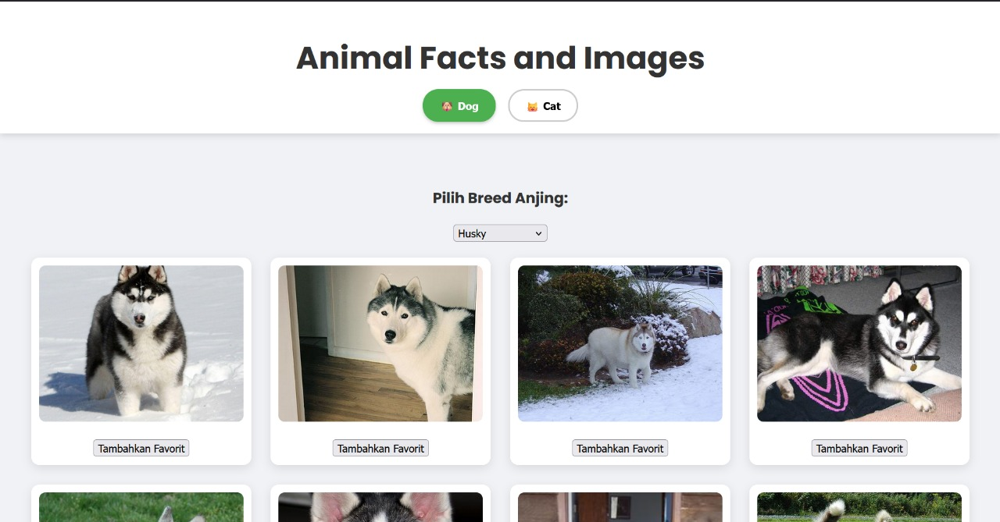
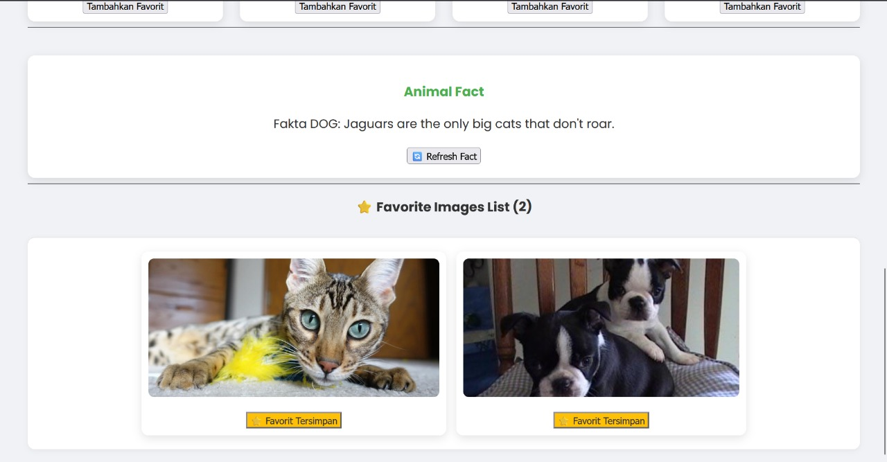

# UTS Pengembangan Aplikasi Web: Animal Facts and Images

**Nama:** Zahwa Natasya Hamzah
**NIM:** 123140069

## Deskripsi Proyek
Aplikasi galeri hewan berbasis ReactJS (Vite) yang menampilkan gambar anjing dan kucing secara acak, dengan fitur navigasi, filter breed, facts, dan penyimpanan favorit di LocalStorage.

## Fitur Wajib
1.  Navigasi switch Dog/Cat
2.  Form dropdown breed
3.  Gallery grid gambar acak
4.  Animal facts dengan Refresh button
5.  Favorite images (LocalStorage)

## Technical Stack
-   **Framework:** ReactJS (Vite)
-   **Styling:** CSS Murni (Grid, Flexbox, Responsive Design)
-   **Deployment:** Vercel

## 🔗 Link Deployment Vercel

**Aplikasi Live:** https://uts-pemweb-069.vercel.app/ 

## 📸 Screenshot Aplikasi




## Cara Instalasi dan Menjalankan

Berikut adalah langkah-langkah untuk menjalankan proyek ini secara lokal:

1.  **Clone Repository:**
    ```bash
    git clone [https://github.com/15-069-ZahwaNatasyaHamzah/uts-pemweb-069](https://github.com/15-069-ZahwaNatasyaHamzah/uts-pemweb-069)
    cd uts-pemweb-069
    ```

2.  **Install Dependencies:**
    Instal semua paket yang diperlukan (Node.js/npm harus sudah terinstal).
    ```bash
    npm install
    ```

3.  **Jalankan Aplikasi:**
    Aplikasi akan berjalan di mode development.
    ```bash
    npm run dev
    ```
4.  **Akses:** Buka `http://localhost:5173/` di browser Anda.